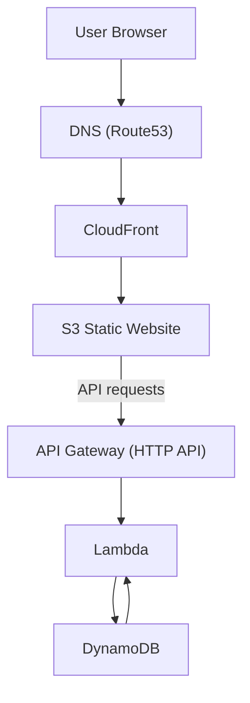

# My Resume

This repository implements a personal resume website following the Cloud Resume Challenge. It includes automated CI/CD, infrastructure-as-code, and a multi-environment deployment setup targeting AWS.

Read more about this project at [here](https://dev.to/urmajesty516/my-attempt-on-cloud-resume-challenge-in-2026-3dh).

## Architecture

- `janice-zhong.com` resolves to a CloudFront distribution backed by an S3 static website bucket.
- The site calls an HTTP API Gateway, which invokes Lambda to read/write a DynamoDB counter.
- TLS: ACM cert in `us-east-1` for CloudFront and in `ap-southeast-2` for API Gateway.



## Multi-environment deployment

- Staging (https://staging.janice-zhong.com): Pull requests merged into `main` trigger the CI/CD pipeline and deploy the site to the `Staging` environment.
- Production (https://janice-zhong.com): Commits that pass CI/CD are promoted to `Prod` by creating a `release/*` branch and tagging the release (for example, `v1.0.0`).

## CI/CD

The pipeline runs the following steps:

- Authenticate to AWS using OpenID Connect (OIDC).
- Upload website artifacts to Amazon S3.
- Invalidate the CloudFront distribution cache.
- Run smoke tests with Cypress to verify the deployment.

## Releases

Create a release branch:

```bash
git checkout -b release/v1.0.0
git push origin release/v1.0.0
```

Create and push a release tag:

```bash
git tag -a v1.0.0 <commit-sha> -m "Release v1.0.0"
git push origin v1.0.0
```

## Infrastructure as Code

The infrastructure is provisioned by the [janice-zhong-iac repository](https://github.com/qianzhong516/janice-zhong-iac), which uses Terraform-based pipelines to manage resources.
