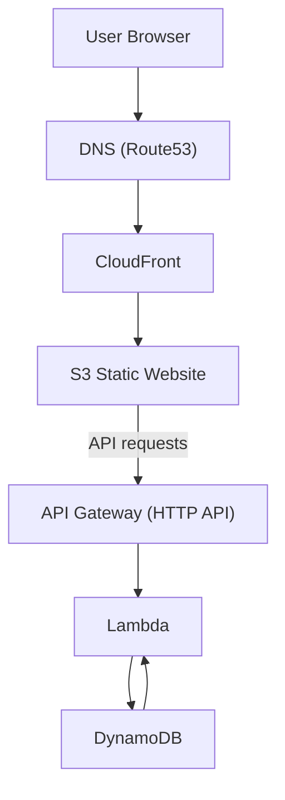

# Serverless Portfolio

**Live Demo:** https://janice-zhong.com

This project demonstrates a production-style serverless deployment on AWS featuring Infrastructure as Code, CI/CD, multi-environment deployment, and a serverless backend that maintains a page visitor counter.

## Table of Contents

- [Technologies](#technologies)
- [Architecture](#architecture)
- [Multi-environment Deployment](#multi-environment-deployment)
- [CI/CD](#cicd)
- [Releases](#releases)
- [Infrastructure as Code Repository](#infrastructure-as-code-repository)
- [Further Reading](#further-reading)

## Technologies

### Infrastructure

- Terraform
- AWS

### Compute

- Lambda
- API Gateway

### Storage

- S3
- DynamoDB

### Networking

- CloudFront
- Route53

### CI/CD

- GitHub Actions
- Cypress

## Architecture

- The application uses managed AWS services to minimize operational overhead while automatically scaling with traffic.
- Static assets are served by CloudFront to reduce application latency.
- API Gateway routes requests to Lambda, eliminating the need of an application server.
- Visitor counts are persisted in DynamoDB, providing a fully managed and scalable data store.



## Multi-environment deployment

Separate staging and production environments are provisioned using Terraform workspaces parameterized by environment-specific variables.

- Staging (https://staging.janice-zhong.com): Staging deployments are triggered by pushes to the main branch.
- Production (https://janice-zhong.com): Production deployments are triggered by pushes to a release branch (e.g, `release/v1.0.0`). Release tags (e.g, `v1.0.0`) are created afterward to provide immutable versioning of production releases.

### Steps to Create a Production Release

1. Create a release branch

   ```bash
   git checkout -b release/v1.0.0
   git push origin release/v1.0.0
   ```

2. Once the production deployment is verified, create a tag for the deployed commit.

   ```bash
   git tag -a v1.0.0 <commit> -m "Release v1.0.0"
   git push origin v1.0.0
   ```

## CI/CD

The application uses a single GitHub Actions workflow to deploy on different environments:

- "Pushes to main" → deploy on staging
- "Pushes to a release branch" → deploy on production

Environment specific variables and secrets are auto selected based on the deployment target.

The workflow performs the following steps:

- Build the application
- Authenticate to AWS using GitHub OIDC
- Upload the static site to Amazon S3
- Invalidate the CloudFront cache
- Run smoke tests with Cypress to verify the deployment

## Infrastructure as Code Repository

The infrastructure is provisioned by the [Serverless Portfolio repository](https://github.com/qianzhong516/serverless-portfolio-iac), which uses Terraform-based pipelines to manage resources.

## Further Reading

I documented the design decisions, implementation process, and lessons learned in this blog post: [My Attempt on the Cloud Resume Challenge](https://dev.to/urmajesty516/my-attempt-on-cloud-resume-challenge-in-2026-3dh).
